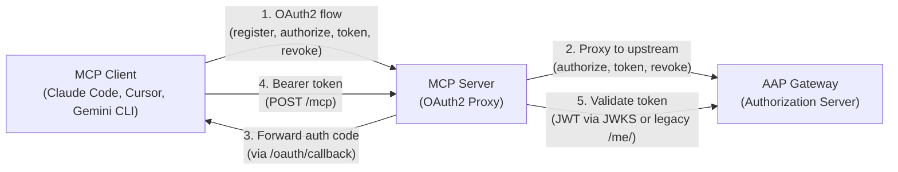
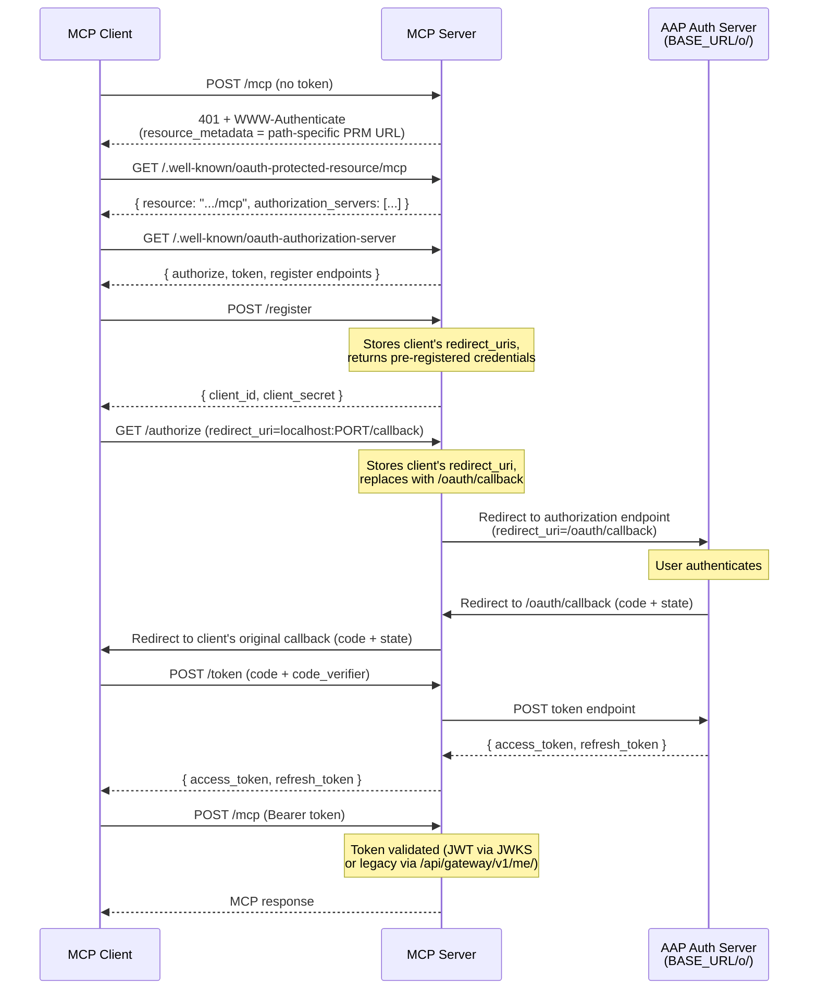
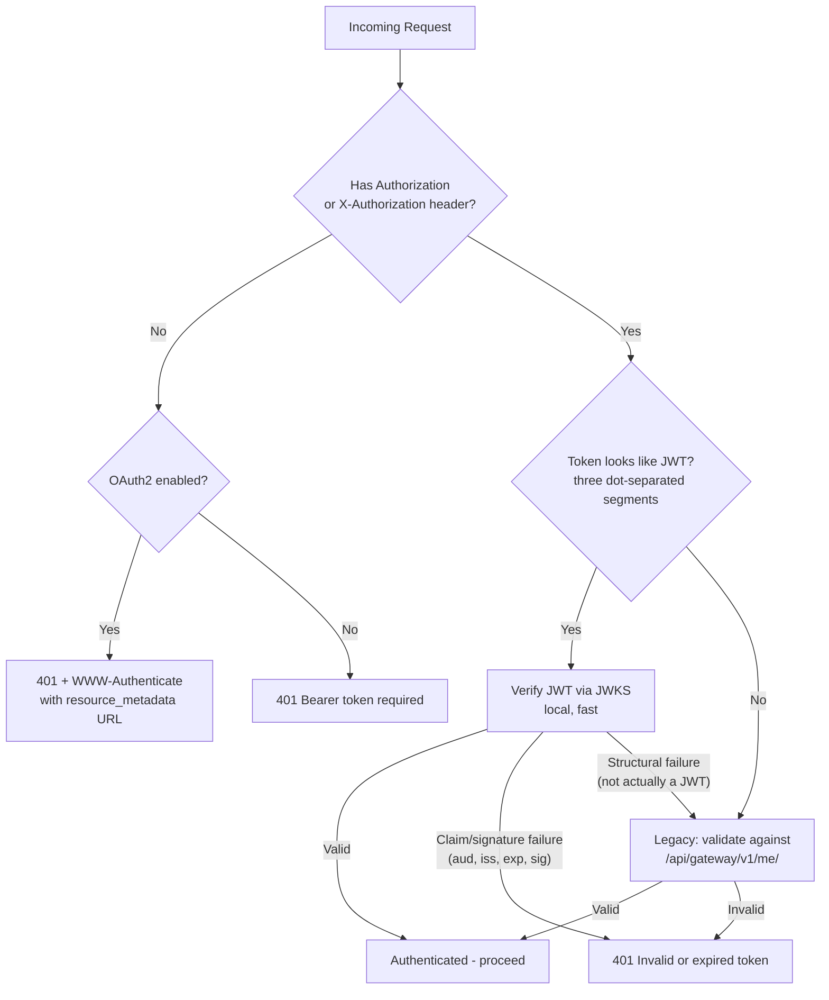
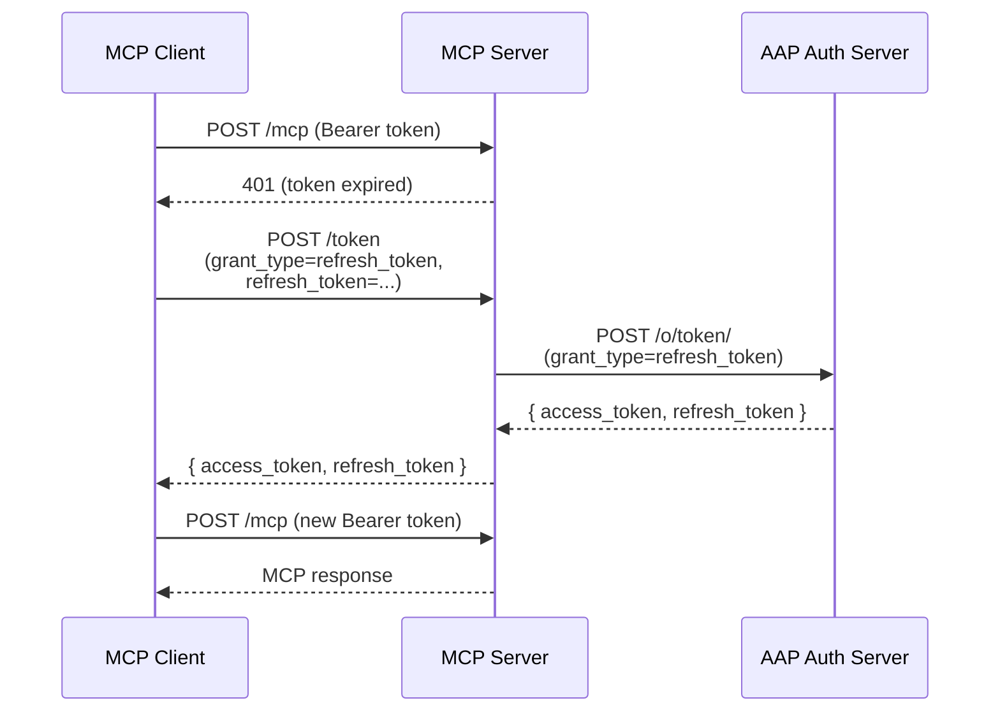
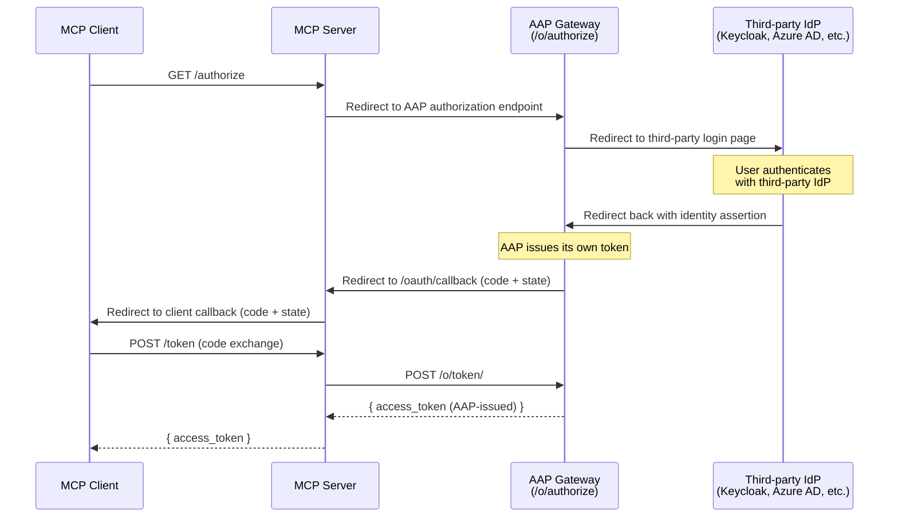

# AAP MCP Server - OAuth2 Integration

## Table of Contents

- [Overview](#overview)
- [Architecture](#architecture)
- [Auth Flow](#auth-flow)
- [Dual Auth Behavior](#dual-auth-behavior)
- [Token Refresh Strategy](#token-refresh-strategy)
- [OAuth 2.1 Compliance](#oauth-21-compliance)
- [AAP Authentication Federation](#aap-authentication-federation)
- [Environment Variables](#environment-variables)
- [Endpoints](#endpoints)
- [Auth Server Registration](#auth-server-registration)
- [Design Decisions](#design-decisions)
- [Files Changed](#files-changed)
- [Deployment](#deployment)
- [Compatibility](#compatibility)

---

## Overview

The AAP MCP Server supports OAuth2 Authorization Code flow with PKCE as an **opt-in** authentication method alongside the existing legacy Bearer token flow. When enabled, MCP clients (Claude Code, Cursor, Gemini CLI, and others) are automatically redirected to the AAP authorization server's login page when no token is present.

OAuth2 is enabled when both `OAUTH2_CLIENT_ID` and `OAUTH2_CLIENT_SECRET` environment variables are set. Otherwise the server works exactly as before.

---

## Architecture



The MCP server acts as an **OAuth2 proxy** between MCP clients and the AAP authorization server. It does not issue tokens itself — it proxies the authorization and token exchange to AAP, while handling client registration and redirect URI intermediation locally.

### Key Components

- **`src/oauth2-provider.ts`** — Core OAuth2 module: OIDC discovery, JWKS verification, `AAPProxyOAuthServerProvider` with client registration, redirect URI intermediary, callback forwarding, and dynamic protected resource metadata.
- **`src/index.ts`** — Integration point: conditional initialization, OAuth2 router forwarding slot, dual-auth middleware (`authenticateRequestWithOAuth2`), and `WWW-Authenticate` headers.

---

## Auth Flow



### Failed Login

When a user enters wrong credentials, the AAP login page stays open and lets the user retry indefinitely — this is standard behavior controlled by the upstream auth server, not by the MCP server. There is no cancel button on the AAP login page.

If the user takes longer than **10 minutes** on the login page (e.g., repeated failed attempts or abandoning the page), the MCP server's pending authorization entry expires and is evicted. If the user eventually logs in successfully after the 10-minute window, the callback returns `"unknown authorization state"` and the user must restart the OAuth flow from the MCP client.

> **Note:** MCP clients may enforce their own login timeout independently of the server's 10-minute pending authorization TTL. For example, a client might cancel the OAuth flow after 2–5 minutes of inactivity. The effective timeout is whichever expires first — the client's or the server's.

---

## Dual Auth Behavior

The server supports two authentication methods simultaneously:



| Scenario                                             | Behavior                                                                                                                                                       |
| ---------------------------------------------------- | -------------------------------------------------------------------------------------------------------------------------------------------------------------- |
| Request with `Authorization` header, token is JWT    | JWT verification via JWKS (local, fast, validates `iss` and `aud`). Claim/signature failures reject immediately; only structural failures fall back to legacy. |
| Request with `Authorization` header, token is opaque | Skips JWT verification, validates directly against `/api/gateway/v1/me/`                                                                                       |
| No `Authorization` header, OAuth2 enabled            | Returns 401 with `WWW-Authenticate` header to trigger OAuth2 flow                                                                                              |
| Invalid/expired token, OAuth2 enabled                | Returns 401 with `WWW-Authenticate: Bearer error="invalid_token"` so clients refresh via `/token` (RFC 6750)                                                   |
| No `Authorization` header, OAuth2 disabled           | Returns 401 as before (legacy behavior)                                                                                                                        |

**JWT format detection**: Tokens are only verified as JWTs if they have three dot-separated segments (`header.payload.signature`). This avoids unnecessary JWKS verification attempts and false error logs when legacy opaque tokens are used.

**JWT fallback policy**: When JWT verification fails, the server distinguishes between security-relevant failures and structural failures. Audience mismatch, issuer mismatch, signature verification failure, and token expiration are **rejected immediately** without falling back to legacy validation — this prevents bypassing audience checks. Only structural errors (e.g., a token that has three dot-separated segments but is not actually a valid JWT) fall back to legacy `/me/` validation.

**Header support**: The server accepts tokens via both `Authorization` and `X-Authorization` headers. The `X-Authorization` header is useful when a reverse proxy or gateway strips the standard `Authorization` header.

---

## Token Refresh Strategy

Token refresh is the **MCP client's responsibility**. The MCP server proxies refresh requests to the upstream AAP auth server transparently.



- The MCP SDK's `ProxyOAuthServerProvider` handles the `refresh_token` grant type automatically.
- All tested MCP clients (Claude Code, Cursor, Gemini) implement token refresh on their side.
- **Refresh token rotation** (issuing a new refresh token on each use) is controlled by the AAP auth server, not the MCP server.
- No additional configuration or code is needed on the MCP server side.

---

## OAuth 2.1 Compliance

### Compliant (MCP Server Side)

| Requirement                              | Status    | Details                                                 |
| ---------------------------------------- | --------- | ------------------------------------------------------- |
| Authorization Code flow                  | Compliant | Only supported grant type (via proxy)                   |
| PKCE                                     | Compliant | Handled by MCP SDK's `ProxyOAuthServerProvider`         |
| No implicit grant                        | Compliant | Not supported by the MCP SDK or our implementation      |
| No resource owner password grant         | Compliant | Not supported by the MCP SDK or our implementation      |
| Exact-match redirect URI validation      | Compliant | SDK validates against registered URIs                   |
| Confidential client                      | Compliant | `client_secret_post` authentication                     |
| Token revocation (RFC 7009)              | Compliant | Proxied to upstream via `/revoke` endpoint              |
| Protected resource metadata (RFC 9728)   | Compliant | Path-specific dynamic metadata                          |
| Authorization server metadata (RFC 8414) | Compliant | Via `mcpAuthRouter`                                     |
| Client registration (RFC 7591)           | Compliant | Local registration returning pre-registered credentials |

### Upstream-Dependent

| Requirement              | Responsibility  | Notes                                                                                                                   |
| ------------------------ | --------------- | ----------------------------------------------------------------------------------------------------------------------- |
| Refresh token rotation   | AAP auth server | OAuth 2.1 recommends rotating refresh tokens on each use                                                                |
| Refresh token expiration | AAP auth server | Must have a defined lifetime                                                                                            |
| Token format             | AAP auth server | Currently issues opaque tokens (valid per OAuth 2.1). If changed to JWT, JWKS verification path activates automatically |

### OIDC Endpoints Not Proxied

AAP's `/.well-known/openid-configuration` advertises additional OpenID Connect endpoints that the MCP server does not proxy. These are **not required for OAuth 2.1 compliance**:

| Endpoint               | Spec                         | Why Not Proxied                                                                                                                                                           |
| ---------------------- | ---------------------------- | ------------------------------------------------------------------------------------------------------------------------------------------------------------------------- |
| `userinfo_endpoint`    | OpenID Connect Core 1.0      | User identity is already obtained from JWT claims (`sub`, `email`, `preferred_username`) or legacy `/api/gateway/v1/me/` validation. A userinfo proxy would be redundant. |
| `end_session_endpoint` | OIDC RP-Initiated Logout 1.0 | MCP clients do not implement a logout flow. Tokens expire naturally. Can be added in the future if needed.                                                                |

The MCP server is an **OAuth2 proxy**, not a full OIDC provider. These endpoints remain accessible directly on the AAP auth server for other consumers that need them.

### Security Considerations

- **JWT audience validation**: Access tokens are verified with `audience: "ansible-services"` to prevent confused deputy attacks where a JWT issued for a different application on the same IdP could be accepted.
- **Redirect URI host allowlist**: The `/register` endpoint only accepts `redirect_uri` hostnames listed in `OAUTH2_ALLOWED_REDIRECT_HOSTS` (defaults to `localhost,127.0.0.1,[::1]`). This prevents open-redirect attacks where an attacker registers an external URI to steal authorization codes. Cloud deployments should set this to their expected MCP client hostnames.
- **Unauthenticated `/register`**: The `/register` endpoint returns pre-registered credentials without authentication. This is required by the MCP protocol — clients have no token yet when they call `/register`. Security relies on the upstream auth server enforcing redirect URI validation: only the pre-registered `/oauth/callback` URI is accepted.
- **OIDC discovery timeout**: The OIDC configuration fetch at startup has a 10-second timeout to prevent the server from hanging indefinitely if the upstream auth server is unreachable.
- **OIDC metadata origin validation**: Discovered endpoint URLs (`authorization_endpoint`, `token_endpoint`, `jwks_uri`, `revocation_endpoint`) are validated against the expected `BASE_URL` origin at startup. This prevents a compromised or misconfigured OIDC discovery response from redirecting auth flows to a malicious server.
- **WWW-Authenticate on all 401s**: When OAuth2 is enabled, all 401 responses include the `WWW-Authenticate` header with `resource_metadata` and `scope`. The `scope` parameter reflects the server's write mode: `"read"` when `ALLOW_WRITE_OPERATIONS=false`, `"read write"` when enabled. This follows RFC 6750 Section 3 and helps MCP clients request only the scopes needed. Missing tokens get `Bearer resource_metadata="...", scope="..."` to trigger the OAuth2 flow. Expired/invalid tokens get `Bearer error="invalid_token", resource_metadata="...", scope="..."` (RFC 6750) so clients refresh via `/token` instead of restarting the full OAuth flow.
- **Rate limiting**: OAuth2 endpoints (`/register`, `/authorize`, `/token`, `/revoke`, `/oauth/callback`, `/.well-known/oauth*`) are rate-limited to 100 requests per minute per IP by default (configurable via `OAUTH2_RATE_LIMIT`). The default is set at 100 to accommodate environments where multiple developers share a NAT gateway. MCP data endpoints (`/mcp`) are not rate-limited.
- **Sanitized error logging**: Request paths in error logs are sanitized to prevent log injection attacks. Error responses return a generic message instead of leaking internal details.
- Pending authorization state entries (mapping OAuth `state` to client redirect URIs) expire after 10 minutes and are automatically evicted to prevent memory buildup.
- Dynamic protected resource metadata responses include `Cache-Control: no-store` to prevent caching of security-sensitive metadata.

---

## AAP Authentication Federation

### Does the MCP Server Need to Change for Federated Auth?

**No.** The MCP server always authenticates against AAP gateway, regardless of whether AAP delegates user authentication to a third-party identity provider (Keycloak, Azure AD, Okta, etc.).



### Why It's Transparent

- The MCP server talks to AAP's OIDC endpoints, not the third-party IdP's.
- AAP's federation with the IdP is invisible to us — AAP handles the redirect to the IdP and back.
- The token we receive is an AAP token, validated against AAP's `/api/gateway/v1/me/`.
- A Keycloak or Azure AD token would not be accepted by AAP APIs — only AAP-issued tokens work.

### OAuth Application Registration

Even in a federated scenario, the OAuth application (client_id / client_secret) is **registered on AAP gateway**, not the third-party IdP. AAP is the authorization server that issues tokens for AAP resources.

### The One Scenario That Would Affect Us

If AAP were reconfigured to **pass through** the third-party IdP's JWT tokens instead of issuing its own opaque tokens, our JWT/JWKS verification path would become active. In that case, the JWKS verification would need to validate against the IdP's signing keys. However, the OIDC discovery at `BASE_URL/o/.well-known/openid-configuration` would reflect the new `jwks_uri` automatically — **no code changes needed**.

---

## Environment Variables

| Variable                                    | Required             | Default                        | Description                                                                                                                                         |
| ------------------------------------------- | -------------------- | ------------------------------ | --------------------------------------------------------------------------------------------------------------------------------------------------- |
| `OAUTH2_CLIENT_ID`                          | For OAuth2           | -                              | Pre-registered client ID on AAP auth server                                                                                                         |
| `OAUTH2_CLIENT_SECRET`                      | For OAuth2           | -                              | Client secret                                                                                                                                       |
| `MCP_SERVER_URL`                            | Recommended          | `http://localhost:${MCP_PORT}` | Server's public URL (used as issuer URL and for callback)                                                                                           |
| `OAUTH2_ALLOWED_REDIRECT_HOSTS`             | Optional             | `localhost,127.0.0.1,[::1]`    | Comma-separated list of hostnames allowed in client `redirect_uri` during registration. See [Compatibility](#compatibility) for known client hosts. |
| `OAUTH2_RATE_LIMIT`                         | Optional             | `100`                          | Maximum OAuth2 requests per minute per IP. Applies to `/register`, `/authorize`, `/token`, `/revoke`, `/oauth/callback`, and `/.well-known/oauth*`. |
| `MCP_DANGEROUSLY_ALLOW_INSECURE_ISSUER_URL` | For HTTP deployments | `false`                        | Set to `true` to allow non-HTTPS issuer URLs. **Must be set as a shell env var, not in `.env`** (the SDK reads it at module import time)            |

---

## Endpoints

| Method   | Path                                           | Description                                                                                                                                                                                   |
| -------- | ---------------------------------------------- | --------------------------------------------------------------------------------------------------------------------------------------------------------------------------------------------- |
| GET      | `/.well-known/oauth-protected-resource`        | Root protected resource metadata ([RFC 9728](https://www.rfc-editor.org/rfc/rfc9728))                                                                                                         |
| GET      | `/.well-known/oauth-protected-resource/{path}` | Path-specific protected resource metadata                                                                                                                                                     |
| GET      | `/.well-known/oauth-authorization-server`      | OAuth2 server metadata ([RFC 8414](https://www.rfc-editor.org/rfc/rfc8414))                                                                                                                   |
| GET/POST | `/authorize`                                   | Proxies to upstream auth server's authorization page                                                                                                                                          |
| POST     | `/token`                                       | Proxies authorization code / refresh token exchange                                                                                                                                           |
| POST     | `/register`                                    | Local client registration ([RFC 7591](https://www.rfc-editor.org/rfc/rfc7591)) - returns pre-registered credentials                                                                           |
| POST     | `/revoke`                                      | Proxies token revocation to upstream auth server ([RFC 7009](https://www.rfc-editor.org/rfc/rfc7009)). Falls back to `BASE_URL/o/revoke_token/` if OIDC metadata omits `revocation_endpoint`. |
| GET      | `/oauth/callback`                              | Receives auth code from upstream, forwards to MCP client                                                                                                                                      |

---

## Auth Server Registration

On your AAP authorization server, register the MCP server as a confidential client:

| Setting                        | Value                                                                                             |
| ------------------------------ | ------------------------------------------------------------------------------------------------- |
| **Client type**                | Confidential                                                                                      |
| **Redirect URI**               | `http://localhost:3044/oauth/callback` (local) or `${MCP_SERVER_URL}/oauth/callback` (production) |
| **Grant types**                | `authorization_code`, `refresh_token`                                                             |
| **Token endpoint auth method** | `client_secret_post`                                                                              |

---

## Design Decisions

1. **Proxy architecture**: OAuth2 is implemented in the MCP server as a proxy to AAP gateway, not directly in the gateway. AAP gateway is already an OAuth 2.0 authorization server, but it does not implement the [MCP authorization specification](https://modelcontextprotocol.io/specification/2025-11-25/basic/authorization) extensions: Protected Resource Metadata (RFC 9728), Authorization Server Metadata (RFC 8414) at root-level `/.well-known` paths, Dynamic Client Registration (RFC 7591), and dynamic `localhost:PORT` redirect URI handling. Implementing these in gateway would require modifying core auth code that affects all AAP consumers (Web UI, CLI, API integrations), coupling MCP protocol evolution to gateway releases, and reconciling the MCP SDK's HTTP router with Django's request lifecycle. The proxy approach is less complex (leverages the MCP SDK's built-in auth components), faster to iterate on (independent release cycle), and keeps the blast radius small (a bug only affects MCP clients, not all of AAP authentication).
2. **Additive**: Existing Bearer token flow is unchanged. OAuth2 is opt-in via environment variables.
3. **Intermediary callback**: The MCP server uses its own `/oauth/callback` as `redirect_uri` with the upstream auth server, then forwards the authorization code to the MCP client's dynamic localhost callback. This avoids needing to register dynamic ports on the auth server.
4. **Local client registration**: MCP clients require [RFC 7591](https://www.rfc-editor.org/rfc/rfc7591) dynamic client registration. The `/register` endpoint accepts registration requests but always returns the pre-registered client credentials.
5. **Dynamic protected resource metadata**: Each MCP endpoint path gets its own `/.well-known/oauth-protected-resource/{path}` response with the correct `resource` field, as required by clients that strict-match the resource URL ([RFC 9728](https://www.rfc-editor.org/rfc/rfc9728)).
6. **Route ordering**: OAuth2 router is mounted before MCP routes via a forwarding slot to ensure `/register`, `/authorize`, `/token`, and `/.well-known/*` are matched first.
7. **JWT format detection**: Tokens are only verified as JWTs if they have three dot-separated segments, avoiding false error logs when legacy opaque tokens are used.
8. **JWT audience validation**: Access tokens are verified with `audience: "ansible-services"` to prevent confused deputy attacks across applications sharing the same IdP.
9. **Redirect URI host allowlist**: Client redirect URIs are validated against a configurable allowlist (`OAUTH2_ALLOWED_REDIRECT_HOSTS`), defaulting to localhost/loopback for local development.
10. **Pending authorization TTL**: Stored redirect URIs expire after 10 minutes with automatic eviction to prevent memory leaks.
11. **Revocation endpoint fallback**: AAP's OIDC metadata does not currently advertise `revocation_endpoint`. The server falls back to the known `BASE_URL/o/revoke_token/` endpoint. Once the upstream metadata is fixed, the discovered endpoint will be used automatically.
12. **OIDC discovery timeout**: 10-second timeout on the OIDC configuration fetch to prevent startup hangs.
13. **OIDC metadata origin validation**: Endpoint URLs from OIDC discovery are validated against the expected `BASE_URL` origin to prevent redirection to a malicious server.
14. **Rate limiting**: OAuth2 endpoints are rate-limited (100 req/min per IP by default, configurable via `OAUTH2_RATE_LIMIT`) to prevent brute-force and abuse. The default accommodates environments where multiple developers share a NAT gateway. MCP data endpoints (`/mcp`) are excluded.
15. **Sanitized error logging**: Request paths are sanitized before logging to prevent log injection. Error responses return generic messages.
16. **JWT fallback policy**: JWT verification failures due to audience, issuer, or signature mismatch are rejected immediately without falling back to legacy `/me/` validation. Only structural failures (token is not actually a JWT) trigger fallback. This prevents bypassing audience validation via the legacy path.
17. **In-memory pending authorization state**: The mapping from OAuth `state` to client redirect URIs is stored in-memory. This means: (a) multi-instance deployments require sticky sessions or a shared store to avoid losing state mid-flow, and (b) a server restart during an active OAuth flow causes the callback to return "unknown authorization state" — the user must restart the OAuth flow from the MCP client. This is acceptable for single-instance deployments; a shared store (e.g., Redis) can be added if horizontal scaling is needed.
18. **X-Forwarded-For on OAuth2 proxy calls**: The OAuth2 proxy injects the MCP client's original IP address as `X-Forwarded-For` on outbound requests to AAP's auth server (`/token`, `/revoke`). This is implemented via a custom `fetch` passed to the SDK's `ProxyOAuthServerProvider` and `AsyncLocalStorage` to carry the client IP through async operations. When the MCP server sits behind a load balancer or gateway, the first IP in an existing `X-Forwarded-For` chain is used. This ensures AAP can audit which client initiated the OAuth2 flow. The `/authorize` call does not need `X-Forwarded-For` because it is a browser redirect — the user's browser navigates directly to AAP's authorization endpoint, so AAP already sees the user's real IP. Only the server-to-server calls (`/token`, `/revoke`) need it, as those are `fetch` calls made by the proxy where AAP would otherwise see the proxy's IP. **Note:** `X-Forwarded-For` is **not** added to tool execution calls (`POST /mcp` → AAP API) or legacy token validation (`/api/gateway/v1/me/`). Those are general proxy concerns outside the scope of OAuth2 and should be addressed separately in a dedicated RFE or issue.

---

## Files Changed

### `src/oauth2-provider.ts` (new)

- OIDC discovery from `${BASE_URL}/o/.well-known/openid-configuration` (10-second timeout)
- JWT verification via JWKS (`jose` library) with `audience: "ansible-services"` validation
- `AAPProxyOAuthServerProvider`: extends `ProxyOAuthServerProvider` with local client registration, `redirect_uri` intermediary, redirect URI host allowlist, and authorization code forwarding
- Pending authorization TTL (10 min) with automatic eviction
- Dynamic protected resource metadata handler with `Cache-Control: no-store`
- Custom `fetch` with `AsyncLocalStorage` to inject `X-Forwarded-For` on outbound OAuth2 proxy calls
- `mcpAuthRouter` configuration

### `src/index.ts` (modified)

- Config entries: `OAUTH2_CLIENT_ID`, `OAUTH2_CLIENT_SECRET`, `MCP_SERVER_URL`, `OAUTH2_ALLOWED_REDIRECT_HOSTS`
- OAuth2 router forwarding slot with rate limiting (before MCP routes)
- Conditional OAuth2 initialization in `main()`
- Path-specific `WWW-Authenticate` headers in early auth middleware
- `authenticateRequestWithOAuth2()`: JWT-first dual auth with format detection
- Sanitized error handler for OAuth2 router errors
- Startup banner shows OAuth2 status

---

## Deployment

### Local Development

#### AAP OAuth Application Setup

Create an OAuth Application in AAP with the following settings:

| Setting                      | Value                                  |
| ---------------------------- | -------------------------------------- |
| **Name**                     | MCP-Server                             |
| **Organization**             | Default                                |
| **Authorization Grant Type** | Authorization code                     |
| **Client Type**              | Confidential                           |
| **Algorithm**                | No OIDC support                        |
| **Skip Authorization**       | Yes                                    |
| **Redirect URIs**            | `http://localhost:3044/oauth/callback` |

After creation, AAP provides the `client_id` and `client_secret` to use below.

#### MCP Server Environment

```bash
# .env
OAUTH2_CLIENT_ID=your-client-id
OAUTH2_CLIENT_SECRET=your-client-secret
MCP_SERVER_URL=http://localhost:3044
OAUTH2_ALLOWED_REDIRECT_HOSTS=www.cursor.com,anysphere.cursor-mcp,localhost,127.0.0.1,[::1]
```

### Cloud / Production

```bash
# Shell environment (not .env) — only if using HTTP
export MCP_DANGEROUSLY_ALLOW_INSECURE_ISSUER_URL=true

# .env or environment
OAUTH2_CLIENT_ID=your-client-id
OAUTH2_CLIENT_SECRET=your-client-secret
MCP_SERVER_URL=https://mcp.example.com
OAUTH2_ALLOWED_REDIRECT_HOSTS=myapp.example.com,other.example.com
```

Register `https://mcp.example.com/oauth/callback` as the redirect URI on your AAP auth server.

---

## Compatibility

| Client              | Status                               | Redirect URI Hosts                       |
| ------------------- | ------------------------------------ | ---------------------------------------- |
| Claude Code         | Working                              | `localhost`                              |
| Cursor              | Working                              | `www.cursor.com`, `anysphere.cursor-mcp` |
| Gemini CLI          | Working (requires path-specific PRM) | `localhost`                              |
| Legacy Bearer token | Unchanged behavior                   | N/A                                      |

**Note**: Clients that use non-localhost redirect hosts (e.g., Cursor) require those hosts to be added to `OAUTH2_ALLOWED_REDIRECT_HOSTS`. Example for Cursor:

```bash
OAUTH2_ALLOWED_REDIRECT_HOSTS=www.cursor.com,anysphere.cursor-mcp,localhost,127.0.0.1,[::1]
```
